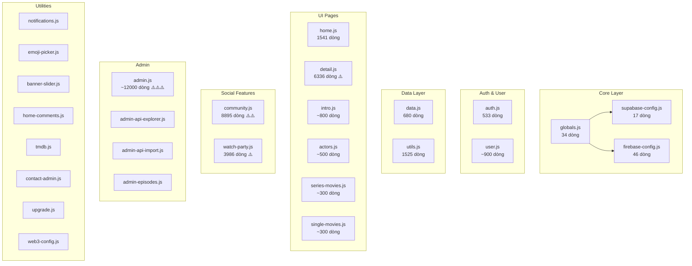

# 🔄 Phân Tích Chuyển Đổi Trạm Phim → React Native

## 📊 Tổng Quan Dự Án Hiện Tại

### Kiến trúc hiện tại: Single Page Application (SPA) thuần HTML/JS

| Thành phần | Công nghệ | Kích thước |
|---|---|---|
| Frontend | Vanilla HTML/CSS/JS (SPA) | ~1.750 dòng HTML, ~825K JS |
| Backend/DB | Supabase (PostgreSQL + Auth + Realtime + Storage) | Cloud |
| Video | HLS.js + iframe embed + HTML5 `<video>` | CDN |
| Realtime | Supabase Channels (Presence + Postgres Changes) | Cloud |
| Voice Chat | PeerJS (WebRTC) | P2P |
| Blockchain | Ethers.js + MetaMask (Cronos Chain) | Web3 |
| Firebase | Chỉ còn Firestore Persistence (Legacy) | Đang loại bỏ |

### Danh sách 33 file JS (tổng ~1.9MB source code)



---

## 🎯 Các Tính Năng Chính Cần Chuyển Đổi

### Ưu tiên 1: Core Features (MVP)

| # | Tính năng | File gốc | Độ phức tạp | Ghi chú RN |
|---|---|---|---|---|
| 1 | **Trang chủ** (Banner, Phim nổi bật, Phim mới) | `home.js` | 🟡 Trung bình | `FlatList`, `ScrollView`, `Animated` |
| 2 | **Chi tiết & Xem phim** (Player, Episodes, Comments) | `detail.js` (6336 dòng!) | 🔴 Cao | `react-native-video` / `expo-video` |
| 3 | **Xác thực** (Email/Password, Google OAuth) | `auth.js` | 🟢 Dễ | `@supabase/supabase-js` hoạt động trên RN |
| 4 | **Điều hướng** (SPA hash routing) | `utils.js`, `main.js` | 🟡 Trung bình | `expo-router` hoặc `@react-navigation` |
| 5 | **Tìm kiếm & Lọc phim** | `home.js` | 🟡 Trung bình | `TextInput` + filter logic |
| 6 | **Thể loại / Diễn viên** | `actors.js`, filter logic | 🟢 Dễ | Grid views |
| 7 | **Dark/Light Theme** | `variables.css` | 🟢 Dễ | React Context + `useColorScheme` |

### Ưu tiên 2: Social & Community

| # | Tính năng | File gốc | Độ phức tạp | Ghi chú RN |
|---|---|---|---|---|
| 8 | **Cộng đồng** (Feed, Posts, Comments, Likes) | `community.js` (8895 dòng!) | 🔴 Rất cao | Cần chia nhỏ ra nhiều screens |
| 9 | **CineChat** (Chat 1-1, Tin nhắn, Ảnh, Typing) | `community.js` | 🔴 Rất cao | `GiftedChat` hoặc custom |
| 10 | **Cuộc gọi** (Video/Audio call PeerJS) | `community.js` | 🔴 Rất cao | `react-native-webrtc` |

### Ưu tiên 3: Watch Party & Premium

| # | Tính năng | File gốc | Độ phức tạp | Ghi chú RN |
|---|---|---|---|---|
| 11 | **Watch Party** (Phòng xem chung, Sync video, Voice chat) | `watch-party.js` | 🔴 Cực cao | WebRTC + Sync logic phức tạp |
| 12 | **Thanh toán Crypto** (MetaMask, Cronos) | `web3-config.js` | 🔴 Cao | WalletConnect / Deep link |

### Ưu tiên 4: Admin (Có thể giữ Web)

| # | Tính năng | File gốc | Độ phức tạp | Ghi chú |
|---|---|---|---|---|
| 13 | **Trang Admin** (CRUD phim, User, API Import) | `admin.js` (~12000 dòng) | ❌ Không nên | Giữ nguyên web admin |

---

## 🏗️ Kiến Trúc React Native Đề Xuất

### Stack công nghệ

```
📦 Expo SDK 53+ (Managed Workflow)
├── expo-router (File-based routing)
├── @supabase/supabase-js (DB + Auth + Realtime)
├── expo-video hoặc react-native-video (Player)
├── react-native-reanimated (Animations)
├── @react-native-async-storage/async-storage (Cache)
├── expo-image (Ảnh tối ưu)
├── react-native-gesture-handler (Gestures)
├── nativewind hoặc StyleSheet (Styling)
└── zustand hoặc jotai (State management)
```

### Cấu trúc thư mục đề xuất

```
TramPhim-RN/
├── app/                          # Expo Router pages
│   ├── (tabs)/                   # Tab navigation
│   │   ├── index.tsx             # Trang chủ
│   │   ├── movies.tsx            # Tất cả phim
│   │   ├── community.tsx         # Cộng đồng
│   │   └── profile.tsx           # Tài khoản
│   ├── movie/
│   │   ├── [id].tsx              # Chi tiết phim (Intro)
│   │   └── watch/[id].tsx        # Xem phim (Player)
│   ├── category/[slug].tsx       # Phim theo thể loại
│   ├── actor/[id].tsx            # Chi tiết diễn viên
│   ├── watch-party/
│   │   ├── index.tsx             # Danh sách phòng
│   │   └── [roomId].tsx          # Trong phòng xem
│   ├── chat/
│   │   └── [userId].tsx          # Chat 1-1
│   └── auth/
│       ├── login.tsx
│       └── register.tsx
│
├── components/                   # UI Components
│   ├── movie/
│   │   ├── MovieCard.tsx
│   │   ├── MovieGrid.tsx
│   │   ├── BannerSlider.tsx
│   │   ├── EpisodeList.tsx
│   │   └── VideoPlayer.tsx
│   ├── community/
│   │   ├── PostCard.tsx
│   │   ├── PostComposer.tsx
│   │   └── ChatBubble.tsx
│   ├── common/
│   │   ├── LoadingSpinner.tsx
│   │   ├── NotificationToast.tsx
│   │   └── SearchBar.tsx
│   └── layout/
│       ├── TabBar.tsx
│       └── Header.tsx
│
├── lib/                          # Business logic
│   ├── supabase.ts               # Supabase client config
│   ├── types.ts                  # TypeScript types
│   └── constants.ts              # App constants
│
├── stores/                       # State management (Zustand)
│   ├── useAuthStore.ts
│   ├── useMovieStore.ts
│   ├── useCommunityStore.ts
│   └── useThemeStore.ts
│
├── hooks/                        # Custom React hooks
│   ├── useMovies.ts
│   ├── useAuth.ts
│   ├── useWatchHistory.ts
│   └── useRealtimePresence.ts
│
├── services/                     # API & data services
│   ├── movieService.ts           # CRUD phim (từ data.js)
│   ├── authService.ts            # Auth logic (từ auth.js)
│   ├── communityService.ts       # Posts, chat, friends
│   ├── watchPartyService.ts      # Room management
│   └── notificationService.ts
│
├── utils/                        # Utilities
│   ├── format.ts                 # formatNumber, formatDate, etc.
│   ├── cache.ts                  # LocalStorage → AsyncStorage
│   └── helpers.ts                # removeDiacritics, createSlug
│
├── theme/                        # Design tokens
│   ├── colors.ts                 # Từ variables.css
│   ├── typography.ts
│   └── spacing.ts
│
└── assets/                       # Static assets
    ├── sounds/
    └── images/
```

---

## 🔑 Mapping Chi Tiết: Web → React Native

### 1. Data Layer (`data.js` → `stores/` + `services/`)

```
Web (Vanilla JS)                    →  React Native
─────────────────────────────────     ──────────────────────
let allMovies = [];                  →  useMovieStore (zustand)
let currentUser = null;              →  useAuthStore (zustand)
localStorage cache                   →  AsyncStorage
supabase.from('movies').select()     →  movieService.ts (giữ nguyên API)
supabase.auth.onAuthStateChange()    →  useAuth hook
Supabase Realtime channels           →  useRealtimePresence hook
```

### 2. Navigation (`showPage()` → `expo-router`)

```
Web: showPage('home')               →  router.push('/(tabs)/')
Web: showPage('movieDetail')        →  router.push('/movie/watch/[id]')
Web: showPage('community')          →  router.push('/(tabs)/community')
Web: hash routing (#/watch/slug)    →  Deep linking native
```

### 3. Video Player (`detail.js` → `VideoPlayer.tsx`)

```
Web: HLS.js + <video> element       →  expo-video / react-native-video
Web: iframe embed (YouTube)          →  react-native-youtube-iframe
Web: Custom controls overlay         →  Custom RN controls (Animated)
Web: Fullscreen API                  →  expo-screen-orientation + StatusBar
Web: PiP (Picture-in-Picture)        →  react-native-pip-android (limited iOS)
```

### 4. UI Components

```
Web: DOM manipulation (innerHTML)    →  React Components (JSX)
Web: CSS classes toggle              →  StyleSheet + state
Web: CSS Grid/Flexbox                →  RN Flexbox (YogaLayout)
Web: Font Awesome icons              →  @expo/vector-icons (FontAwesome5)
Web: Google Fonts (Montserrat)       →  expo-font
Web: SweetAlert2 popups              →  Custom Modal / react-native-modal
Web: Scroll animations               →  react-native-reanimated
```

### 5. Auth (`auth.js` → `authService.ts`)

```
Web: supabase.auth.signInWithOAuth   →  Expo AuthSession + Supabase
Web: supabase.auth.signInWithPassword →  Giữ nguyên (hoạt động trên RN)
Web: supabase.auth.signUp            →  Giữ nguyên
Web: Google OAuth redirect            →  expo-auth-session (Google)
```

---

## ⚠️ Thách Thức & Rủi Ro

### 🔴 Rủi ro Cao

| Vấn đề | Giải pháp |
|---|---|
| **detail.js quá lớn** (6336 dòng) → Phải tách thành nhiều components | Chia thành: `VideoPlayer`, `EpisodeList`, `CommentSection`, `MovieInfo`, `ServerSelector` |
| **community.js cực lớn** (8895 dòng) → Chat + Feed + Profile + Call | Chia thành: Feed module, Chat module, Profile module, Call module |
| **DOM manipulation trực tiếp** → Không tương thích RN | Viết lại hoàn toàn UI bằng React components |
| **CSS phức tạp** (~825KB CSS) → RN dùng StyleSheet | Xây dựng design system mới từ `variables.css` tokens |
| **HLS.js streaming** → Cần thư viện native | `react-native-video` hỗ trợ HLS natively |
| **PeerJS/WebRTC** cho Voice Chat | `react-native-webrtc` - setup phức tạp hơn web |

### 🟡 Rủi ro Trung bình

| Vấn đề | Giải pháp |
|---|---|
| **iframe embed** cho video từ bên thứ 3 | `react-native-webview` (giảm hiệu năng) |
| **MetaMask/Crypto** thanh toán | WalletConnect v2 + Deep linking |
| **Keyboard handling** trên chat | `KeyboardAvoidingView` + offset |
| **Lazy loading scripts** (web) → RN load tất cả | Code splitting bằng `React.lazy` + Suspense |

### 🟢 Thuận lợi

| Yếu tố | Chi tiết |
|---|---|
| **Supabase SDK** | `@supabase/supabase-js` hoạt động 100% trên React Native |
| **Business logic** | Phần lớn logic JS (filter, sort, format) có thể tái sử dụng |
| **Realtime** | Supabase Realtime channels hoạt động trên RN |
| **Auth** | Supabase Auth hoạt động trên RN (cần AsyncStorage adapter) |
| **Design tokens** | `variables.css` có thể map trực tiếp sang `theme/colors.ts` |

---

## 📋 Lộ Trình Migration (Đề Xuất)

### Phase 1: Foundation (2-3 tuần)
- [ ] Khởi tạo Expo project + cấu hình
- [ ] Setup Supabase client cho RN (AsyncStorage adapter)
- [ ] Xây dựng Design System (colors, typography, spacing)
- [ ] Auth flow (Login/Register/Google OAuth)
- [ ] Tab navigation cơ bản

### Phase 2: Core Movie Experience (3-4 tuần)
- [ ] Trang chủ: Banner slider, Phim nổi bật, Phim mới
- [ ] Movie Card component
- [ ] Trang chi tiết phim (Intro page)
- [ ] Video Player (HLS + controls)
- [ ] Episode list + Server selector
- [ ] Tìm kiếm + Lọc phim
- [ ] Thể loại / Diễn viên

### Phase 3: User Features (2-3 tuần)
- [ ] Profile & Settings
- [ ] Yêu thích / Watch History
- [ ] Bình luận & Đánh giá
- [ ] Thông báo (Push notifications)
- [ ] Dark/Light theme

### Phase 4: Community (3-4 tuần)
- [ ] Feed (Posts, Likes, Comments)
- [ ] CineChat (Chat 1-1)
- [ ] Bạn bè / Follow
- [ ] Gửi ảnh trong chat

### Phase 5: Watch Party (3-4 tuần)
- [ ] Danh sách phòng
- [ ] Tạo/Tham gia phòng
- [ ] Sync video realtime
- [ ] Voice chat (WebRTC)

### Phase 6: Premium (2 tuần)
- [ ] Thanh toán Crypto (WalletConnect)
- [ ] Gói VIP
- [ ] Push notifications nâng cao

> **Tổng ước tính: 15-20 tuần** cho team 1-2 dev fulltime

---

## 💡 Khuyến Nghị Quan Trọng

> [!IMPORTANT]
> ### 1. GIỮ NGUYÊN Trang Admin trên Web
> Trang Admin (~12000 dòng JS) với nhiều tính năng CRUD phức tạp (API Import, Episode management, Dashboard charts) **KHÔNG NÊN** chuyển sang mobile. Giữ nguyên web admin.

> [!TIP]
> ### 2. Tái sử dụng Business Logic
> Các hàm thuần logic (không DOM) trong `data.js`, `utils.js` có thể copy sang RN gần như nguyên vẹn:
> - `normalizeMovieData()` — mapping data
> - `removeDiacritics()` — tìm kiếm không dấu
> - `formatNumber()`, `formatDate()`, `formatTimeAgo()` — format
> - `createSlug()` — URL generation
> - Filter logic trong `filterMovies()`, `filterActors()`

> [!WARNING]
> ### 3. Supabase trên RN cần cấu hình đặc biệt
> ```ts
> import AsyncStorage from '@react-native-async-storage/async-storage'
> import { createClient } from '@supabase/supabase-js'
> 
> export const supabase = createClient(SUPABASE_URL, SUPABASE_ANON_KEY, {
>   auth: {
>     storage: AsyncStorage,      // ← Bắt buộc cho RN
>     autoRefreshToken: true,
>     persistSession: true,
>     detectSessionInUrl: false,  // ← Tắt vì RN không có URL bar
>   },
> })
> ```

> [!CAUTION]
> ### 4. Video Player là phần khó nhất
> Web dự án dùng hệ thống multi-source phức tạp (KKPhim, OPhim, NguonC) với auto-fallback giữa các server. Trên RN cần:
> - `react-native-video` cho HLS streams
> - `react-native-webview` cho iframe embeds (backup)
> - Custom controls overlay bằng `Animated` API
> - Xử lý orientation lock khi fullscreen

---

## 📊 Thống Kê Dự Án

| Metric | Giá trị |
|---|---|
| Tổng file JS | 33 files |
| Tổng dung lượng JS | ~1.9 MB |
| Tổng file CSS | 15 files |
| Tổng dung lượng CSS | ~825 KB |
| File HTML chính | 1 (SPA) + 11 components |
| Supabase tables sử dụng | movies, episodes, categories, countries, actors, profiles, user_favorites, user_purchases, watch_history, watch_rooms, view_logs, app_configs, posts, messages, friends, ... |
| Số trang/views | ~15 (Home, Movies, Detail, Intro, Categories, Actors, WatchParty, Community Feed/Chat/Profile, Admin, Contact, Terms, Privacy, Upgrade) |
| External APIs | TMDB, KKPhim, OPhim, NguonC, Metered.ca (TURN), ImgBB, Cloudflare R2 |
